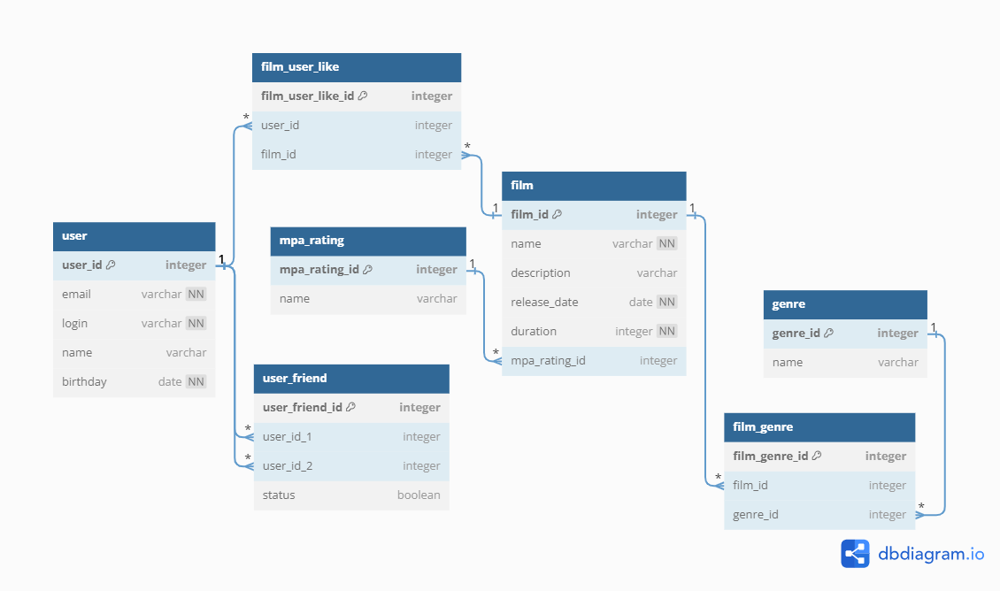

# java-filmorate
Filmorate – сервис для оценки и рекомендации фильмов. Реализовал backend часть, а именно: работа с фильмами (добавление, удаление, редактирование), управление друзьями пользователя, добавление оценок (лайков) к фильмам и вывод топа самых высокооценённых фильмов.</br>

Используемый стек технологий: Java 11, Spring Boot, PostgreSQL.

Ссылка на документацию javadoc [GitHub Pages](https://omon4412.github.io/java-filmorate/).

ER-диаграмма:


# Описание таблиц
| Название таблицы | Описание |
| --- | --- |
| user | Таблица содержит информацию о пользователях вашего веб-приложения |
| user_friend | Таблица содержит информацию о друзьях среди пользователей |
| film | Таблица содержит информацию о фильмах |
| film_user_like | Таблица содержит информацию о лайках у каждого фильма |
| mpa_rating | Таблица содержит информацию о типах рейтинга |
| genre | Таблица содержит информацию о типах жанров |
| film_genre | Таблица содержит информацию о жанрах у каждого фильма |

# Некоторые запросы к базе данных:<br/>

**Возвращает список всех пользователей:** 
```SQL
SELECT * FROM user;
```

**Возвращает пользователя по id:**
```SQL
SELECT * FROM user
WHERE user_id = {id};
```

**Возвращает список друзей пользователя:**
```SQL
SELECT user.user_id,
       user.name
FROM user_friend AS f1
JOIN USER ON f1.user_id = user.user_id
WHERE f1.friend_id = {id}
UNION
SELECT user.user_id,
       user.name
FROM user_friend AS f2
JOIN USER ON f2.friend_id = user.user_id
WHERE f2.user_id = {id}
```

**Возвращает список общих друзей у двух пользователей:**
```SQL
(SELECT user.user_id
   FROM user_friend AS f1
   JOIN USER ON f1.user_id = user.user_id
   WHERE f1.friend_id = {user_id_1}
   UNION
SELECT user.user_id
   FROM user_friend AS f2
   JOIN USER ON f2.friend_id = user.user_id
   WHERE f2.user_id = {user_id_1})
INTERSECT
  (SELECT user.user_id
   FROM user_friend AS f1
   JOIN USER ON f1.user_id = user.user_id
   WHERE f1.friend_id = {user_id_2}
   UNION
SELECT user.user_id
   FROM user_friend AS f2
   JOIN USER ON f2.friend_id = user.user_id
   WHERE f2.user_id = {user_id_2})
```

**Возвращает список всех фильмов:** 
```SQL
SELECT * FROM film;
```

**Взвращает фильм по id:**
```SQL
SELECT * FROM film
WHERE film_id = {id};
```

**Возвращает количество лайков у фильма:**
```SQL
SELECT COUNT(film.film_id) as likes
FROM film_user_like AS f1
JOIN film ON f1.film_id = film.film_id
WHERE f1.film_id = {id}
GROUP BY film.film_id
ORDER BY likes desc
```

**Возвращает список популярных фильмов в порядке убывания лайков:**
```SQL
SELECT film.film_id,
       film.name AS film_name,
       count(film.film_id) AS likes
FROM film_user_like AS f1
JOIN USER ON f1.film_id = user.user_id
JOIN film ON f1.film_id = film.film_id
GROUP BY film.film_id
ORDER BY likes DESC
```
